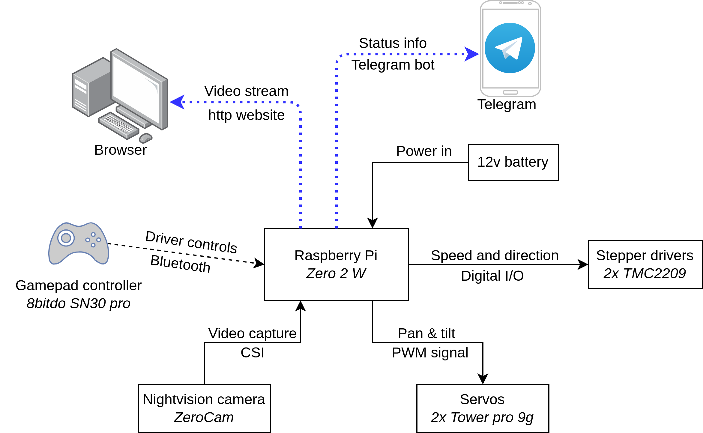

# RC-SpyTank project

> Valtteri Turkki

This repo contains documentation for Raspberry Pi SpyTank project. The idea was to make a fairly low-cost RC tracked vechile. The end result (in the current state) is shown in the below photo:


## Initial idea

Inspired by _RCTESTFLIGHT_ YouTube channels "_Tracked vehicles_" [playlist](https://youtube.com/playlist?list=PLXvxJNOIXBsN97d3_b5AXquRSAQOs3tVV&si=yVQvDruLYLw2IaSi), the idea was to build a RC-track vehicle for mainly indoor use. The key parameters are:

- Footprint of rougly one A4 sheet
- 3D printed tracks that can handle various types of terrain
- Controlling via Raspberry Pi
- Possibility to stream onboard night vision camera footage to phone
- Controlling with a bluetooth gamepad 
- Silent enough operation -> allows for spying in the dark

The 3D models for the tracks and pulleys that were used as the basis of the design are from _RCTESTFLIGHT_ Thingiverse page "_Snow Tank_" [https://www.thingiverse.com/thing:4308626](https://www.thingiverse.com/thing:4308626). Below photo shows that Snow Tank.


## Components

### Component choices explained

The main board was chosen to be Raspberry Pi zero 2 W as it has small footprint and power consumption, but it still allows you to plug-in the camera directly. The camera was chosen to be the ZeroCam night vision model as it plugs directly into the Pi Zero and allows decent image quality.

The motors were chosen to be NEMA 17 steppers due to the fact that they offer good torque and can be very silent with the Trinamic TMC2209 drivers. Also, as the tank was meant for silent operation and spying, the low top speed wasn't an issue. Furthermore, the NEMA 17 + TMC2209 combo costs as much as one good BLDC motor and you'd still need second motor and the controller...

The drilling machine battery was chosen as power supply as it's quite cheap and has a sturdy casing. If you have a 3S LiPo battery laying around, that's also a good option. The power conversion from 12v to 5v was made with a 'ghetto' solution: Buy a car USB adapter, tear it down and remove the connectors and there you have a step-down converter with 4 euros (compared to the fact that some step-down modules that can do >2A cost more than 20 euros).

### Component list

- Raspberry Pi Zero 2 W, link: [https://www.partco.fi/en/raspberry-pi/raspberry-pi-zero/23529-rpi-zero-2w.html](https://www.partco.fi/en/raspberry-pi/raspberry-pi-zero/23529-rpi-zero-2w.html)
- Night vision camera link: [https://raspberrypi.dk/en/product/zerocam-nightvision/](https://raspberrypi.dk/en/product/zerocam-nightvision/)
- Wireless retro gamepad controller 8BitDo, link: [Verkkokauppa.com](https://www.verkkokauppa.com/fi/product/625627/8BitDo-SN30-Pro-G-Classic-peliohjain-Switch-PC?gclid=Cj0KCQjwi7GnBhDXARIsAFLvH4kF90V24P9MH578vy9AbHDa0Bxwu_4yNMn_T8khJIu9gDgt5_Ec2sgaAj2oEALw_wcB)
- 2x NEMA 17 Stepper motor, link: [https://kauppa.sintosen.com/product/1266/nema-17-stepperi-moottori-18-astetta](https://kauppa.sintosen.com/product/1266/nema-17-stepperi-moottori-18-astetta)
- 2x TMC2209 v2.0 Stepper driver, link: [https://kauppa.sintosen.com/product/676/tmc2209-v20-stepperi-ohjain](https://kauppa.sintosen.com/product/676/tmc2209-v20-stepperi-ohjain) 
- 2x Miniature servo motor for camera tilting and panning (Tower pro 9g), link: [https://www.partco.fi/en/electromechanics/motors/servo-motors/20291-servo-sg90.html](https://www.partco.fi/en/electromechanics/motors/servo-motors/20291-servo-sg90.html)
- 2x OD: 13 mm, ID: 6 mm, width: 6 mm bearings for camera axes (recycled from bicycle pedals), link: [https://www.ebay.co.uk/itm/266305894814](https://www.ebay.co.uk/itm/266305894814)
- 2x Timing belt 160 mm, link: [https://kauppa.sintosen.com/product/899/hammashihna-gt2-6mm-160mm-lenkki](https://kauppa.sintosen.com/product/899/hammashihna-gt2-6mm-160mm-lenkki)
- 2x Pulley, link: [https://kauppa.sintosen.com/product/582/ajoituspyora-gt2-20-hammasta-6mm-hihnalle](https://kauppa.sintosen.com/product/582/ajoituspyora-gt2-20-hammasta-6mm-hihnalle)
- Drilling machince battery Tamforce+ 12v 2Ah, link: [https://www.puuilo.fi/tamforce-akku-12v-2ah](https://www.puuilo.fi/tamforce-akku-12v-2ah)
- 12v to 5v step-down converter for Pi and servos, link: [https://www.puuilo.fi/axxel-usb-autolaturi-12v-kahdella-portilla](https://www.puuilo.fi/axxel-usb-autolaturi-12v-kahdella-portilla)
- 8x 6mm bearings for the wheels, link: [https://hobbyfactory.fi/p41450/avid-6x12x4-revolution-1kpl](https://hobbyfactory.fi/p41450/avid-6x12x4-revolution-1kpl)
- 2x springs for track tensioning, link: [https://hobbyfactory.fi/p41913/team-associated-91834-front-shock-springs-yellow-4-30-lb-in-l44mm](https://hobbyfactory.fi/p41913/team-associated-91834-front-shock-springs-yellow-4-30-lb-in-l44mm)
- 2x M5 bolt with 75 mm length for the track tensoner shaft
- 2x 6 mm rod, length 108 mm for the electronics rail
- 78 mm x 66 mm PCB for soldering the electronics
- M6 threaded rod for axles, link: [https://www.puuilo.fi/kierretanko-rst-a2-1m-m6](https://www.puuilo.fi/kierretanko-rst-a2-1m-m6)
- 1 mm sheet metal with 3 mm holes for the base plate
- approx. 50x M3 nuts and bolts (from 10 mm to 20 mm in length)


## Mechanical solutions

Here are explained some of the key mechanical features of the SpyTank:

### 1) Component placing


The use of perforated steel sheet with 3 mm holes as base plate allows to mount things easily and flexibly. All of the bolts to the bottom are M3 and the 3D models have slotted holes for the bolts, so that the exact position of the parts can be adjusted. The distribution of components is made so that the center of mass of the tank is quite well in the center and thus the tracks should have the lowest possible pressure.

### 2) Camera pan and tilt system


The pan & tilt functionality for the camera is done with 2 miniature servos and liknages made from the same steel wire as the track pins. The axes have bearings to enable smooth rotation. The holes in the servo arms had to be enlargened for the steel wire.

### 3) Front axis and belt tensioning


As the tank has tracks and belt drive, it means that the wheelbase and drive axle to motor shaft distances have to be modifiable. This is done so that motors are fixed on their place, but the front axle has slots in the track direction and thus the belt tension is adjusted by moving the front axle forward or backward. The gear ration is 2:1 which gives the tank already enough torque to climb a hill so steep that it will land on its roof.

### 4) Track tensioning and electronics mounting


In order to allow the track to adapt to the terrain, the rear axle is spring loaded with the tensioning system in the photo above. The axle goes through a holder that has M5 nut intergrated to it. The holder is then installed to a slider mount that also has the RC vehicle spring to provide the tension. To keep things moving linearly, a M5 bolt (75 mm) with the head cut away and a notch made for tightening is inserted to the center.

The electronics PCB and the battery are mounted on two rails. This allows easy attachement of them and also leaves room for future modifiability, in case the electronics gets updated.


## Programming and circuits

### The basic idea of interfaces



The 'mechatronic design schematic' of the SpyTank is shown in the above figure. 

### Wiring schematic


The circuit plan pf the tank is shown above.

### Programming part


The diagram above explains the program logic of the SpyTank. There are 3 classes: `camera`, `motors` (in `stepper.py`) and `controller`. 

The camera class controls the servos of the camera stage and starts the stream. The stream works independently in its own process and is in the `server.py` script. The script is direcly the one from [github.com/waveform80/pistreaming/](https://github.com/waveform80/pistreaming/) with slight modifications to the paths, so that the script can be run from any directory. 

The motors class takes care of converting the input from the controller analog axis [-1, 1] to direction and step delay for right and left motor. Thus, the control is tank-like, ie. you use left analog stick to control left track and the right one for right track. The conversion for the delay is done linearly and there'a a cut-off so that input smaller than it maps to zero velocity $\rightarrow$ motors off.

The controller class takes care of mapping the buttons and axes of the gamepad controller to input. As `pyglet` didn't seem to work with the SN30 Pro controller in wireless more, the controller mapping is done with `evdev`. The implementation is such that adding new buttons should be rather straight forward (the mappings are told in `main.py`). To find more info how to use `evdev` and where the numbers come from, see [python-evdev.readthedocs.io/en/latest/](https://python-evdev.readthedocs.io/en/latest/).

The script `utils.py` contains some accessory functions that make the `main.py` cleaner to read. The Telegram bot messaging is made so that the bot credentials are stored in file `secrets.dat` in format `secret-name;secret-value` and read from there using function `read_credentials()`. Then the code finds the IP local address of the PI and parses a message that contains the IP and the stream link. The message is sent using the bot API as follows
```
url = f"https://api.telegram.org/bot{data['TOKEN']}/sendMessage?chat_id={data['ID']}&text={message}"
    requests.get(url).json()
```
where `TOKEN` is the bot token and `ID` is your Telegram ID (can be found by googling _"How to find my Telegram ID"_ and asking it from a bot).

Finally, to make the `main.py` run on boot up, the `rc.local` file of the Pi has to be modified accordingly: Add lines

```
sleep 15
sudo python3 /home/user-name/SpyTank/Code/main.py &
```
above the `exit 0`. Modify the path to match your code location and note the `&` as otherwise the code will stop the boot (`rc.local` will never exit). This will give the PI time to find network connection etc. After this, the `controller.connect()` method has a default timeout of 40 seconds. If the connection to that gamepad controller is not estabilised in this time, the code will exit.


## Additional instructions

### Baseplate cutting and bending


Above is shown the baseplate dimensions. The plate is bent so that the ends are at 45 degree angle with respect to the bottom and the final parts are vertical. The sides are at 90 degree angle w.r.t. the bottom part.

### 3D printing specs

| **Model name** | **Orientation** | **Supports** | **Print in places**|
|---|---|---|---|
| `camera_base.stl` | As installed (pan axis along z-axis) | From the build plate | Insert 1x M3 nut | 
| `camera_holder.stl` | Backside (with the 2 holes) facing down | From the build plate | Insert 1x M3 nut | 
| `camera_pan_stage.stl` | As installed (pan axis along z-axis) | From the build plate | None | 
| `front_axle_holder.stl` | Axle hole aligned with z-axis | None | None |
| `front_axle_spacer.stl` | Hole aligned with z-axis | None | None |
| `front_pulley.stl` | The outside face of the pulley to build plate | None | None |
| `nema17_mount.stl` | Largest flat face to build plate | None | None |
| `rear_axle_holder.stl` | Axle hole aligned with horizontally | None | Insert 1x M5 nut |
| `rear_axle_holder_slider.stl` | So that the slotted hole on on the top is horizontally | None | None |
| `rear_axle_spacer.stl` | Axle hole aligned with z-axis | None | None |
| `rear_pulley.stl` | Same as `front_pulley.stl`| None | None |
| `track_link.stl` | So that the track pin holes are horizontally | None | None |
| `drill_battery_holder.stl` | The flat face with 2 holes facing down | Use enforcers for the rail mounts | None |
| `pcb_carrier.stl` | Top part (largest flat face) facing down | None | Insert the main PCB and 6x M3 nuts for enclosure attachment |
| `rail_holder_back.stl` | Rail hole axis aligned with the z-axis, holes opening upwards | None | None |
| `rail_holder_front.stl` | Axle hole aligned with z-axis, holes opening upwards | None | None |
| `rpi_pcb_spacer.stl` | Axle aligned with z-axis| None | None |
| `stepper_wire_connector.stl` | PCB and slotted holes vertically | None | Insert a small PCB |

All parts were printed with Prusa Mini using 0.4 mm nozzle and PETG filament. The default layer height was 0.25 mm (draft quality) and variable layer height was used for parts with holes that have to be precise and have axis perpendicular to z-axis while printing. For high mechanical stress parts (axle holders and pulleys), the number of perimeters was increased to 3 from the default 2.