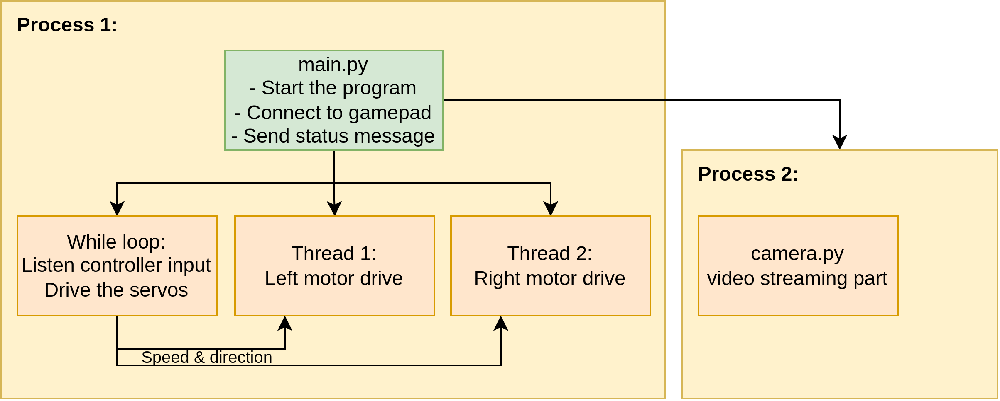

# RC-SpyTank project

> Valtteri Turkki

This repo contains documentation for Raspberry Pi SpyTank project. The idea was to make a fairly low-cost RC tracked vechile. The end result (in the current state) is shown in the below photo:


## Initial idea

Inspired by _RCTESTFLIGHT_ YouTube channels "_Tracked vehicles_" [playlist](https://youtube.com/playlist?list=PLXvxJNOIXBsN97d3_b5AXquRSAQOs3tVV&si=yVQvDruLYLw2IaSi), the idea was to build a RC-track vehicle for mainly indoor use. The key parameters are:

- Footprint of rougly one A4 sheet
- 3D printed tracks that can handle various types of terrain
- Controlling via Raspberry Pi
- Possibility to stream onboard night vision camera footage to phone
- Controlling with a bluetooth gamepad 
- Silent enough operation -> allows for spying in the dark

The 3D models for the tracks and pulleys that were used as the basis of the design are from _RCTESTFLIGHT_ Thingiverse page "_Snow Tank_" [https://www.thingiverse.com/thing:4308626](https://www.thingiverse.com/thing:4308626). Below photo shows that Snow Tank.


## Components

### Component choices explained

The main board was chosen to be Raspberry Pi zero 2 W as it has small footprint and power consumption, but it still allows you to plug-in the camera directly. The camera was chosen to be the ZeroCam night vision model as it plugs directly into the Pi Zero and allows decent image quality.

The motors were chosen to be NEMA 17 steppers due to the fact that they offer good torque and can be very silent with the Trinamic TMC2209 drivers. Also, as the tank was meant for silent operation and spying, the low top speed wasn't an issue. Furthermore, the NEMA 17 + TMC2209 combo costs as much as one good BLDC motor and you'd still need second motor and the controller...

The drilling machine battery was chosen as power supply as it's quite cheap and has a sturdy casing. If you have a 3S LiPo battery laying around, that's also a good option. The power conversion from 12v to 5v was made with a 'ghetto' solution: Buy a car USB adapter, tear it down and remove the connectors and there you have a step-down converter with 4 euros (compared to the fact that some step-down modules that can do >2A cost more than 20 euros).

### Component list

- Raspberry Pi Zero 2 W, link: [https://www.partco.fi/en/raspberry-pi/raspberry-pi-zero/23529-rpi-zero-2w.html](https://www.partco.fi/en/raspberry-pi/raspberry-pi-zero/23529-rpi-zero-2w.html)
- Night vision camera link: [https://raspberrypi.dk/en/product/zerocam-nightvision/](https://raspberrypi.dk/en/product/zerocam-nightvision/)
- Wireless retro gamepad controller 8BitDo, link: [Verkkokauppa.com](https://www.verkkokauppa.com/fi/product/625627/8BitDo-SN30-Pro-G-Classic-peliohjain-Switch-PC?gclid=Cj0KCQjwi7GnBhDXARIsAFLvH4kF90V24P9MH578vy9AbHDa0Bxwu_4yNMn_T8khJIu9gDgt5_Ec2sgaAj2oEALw_wcB)
- 2x NEMA 17 Stepper motor, link: [https://kauppa.sintosen.com/product/1266/nema-17-stepperi-moottori-18-astetta](https://kauppa.sintosen.com/product/1266/nema-17-stepperi-moottori-18-astetta)
- 2x TMC2209 v2.0 Stepper driver, link: [https://kauppa.sintosen.com/product/676/tmc2209-v20-stepperi-ohjain](https://kauppa.sintosen.com/product/676/tmc2209-v20-stepperi-ohjain) 
- 2x Miniature servo motor for camera tilting and panning (Tower pro 9g), link: [https://www.partco.fi/en/electromechanics/motors/servo-motors/20291-servo-sg90.html](https://www.partco.fi/en/electromechanics/motors/servo-motors/20291-servo-sg90.html)
- 2x Timing belt 160 mm, link: [https://kauppa.sintosen.com/product/899/hammashihna-gt2-6mm-160mm-lenkki](https://kauppa.sintosen.com/product/899/hammashihna-gt2-6mm-160mm-lenkki)
- 2x Pulley, link: [https://kauppa.sintosen.com/product/582/ajoituspyora-gt2-20-hammasta-6mm-hihnalle](https://kauppa.sintosen.com/product/582/ajoituspyora-gt2-20-hammasta-6mm-hihnalle)
- Drilling machince battery Tamforce+ 12v 2Ah, link: [https://www.puuilo.fi/tamforce-akku-12v-2ah](https://www.puuilo.fi/tamforce-akku-12v-2ah)
- 12v to 5v step-down converter for Pi and servos, link: [https://www.puuilo.fi/axxel-usb-autolaturi-12v-kahdella-portilla](https://www.puuilo.fi/axxel-usb-autolaturi-12v-kahdella-portilla)
- 8x 6mm bearings for the wheels, link: [https://hobbyfactory.fi/p41450/avid-6x12x4-revolution-1kpl](https://hobbyfactory.fi/p41450/avid-6x12x4-revolution-1kpl)
- 2x springs for track tensioning, link: [https://hobbyfactory.fi/p41913/team-associated-91834-front-shock-springs-yellow-4-30-lb-in-l44mm](https://hobbyfactory.fi/p41913/team-associated-91834-front-shock-springs-yellow-4-30-lb-in-l44mm)
- 2x M5 bolt with 75 mm length for the track tensoner shaft
- M6 threaded rod for axles, link: [https://www.puuilo.fi/kierretanko-rst-a2-1m-m6](https://www.puuilo.fi/kierretanko-rst-a2-1m-m6)
- 1 mm sheet metal with 3 mm holes for the base plate
- approx. 50x M3 nuts and bolts (from 10 mm to 20 mm in length)


## Mechanical solutions

This will be updated in future...


## Programming and circuits

### The basic idea of interfaces


### Wiring schematic


### Program flow



### Making the Pi run the code at power up

To make the `main.py` run on boot up, the `rc.local` file of the Pi has to be modified accordingly: Add lines

```
sleep 15
sudo python3 /home/user-name/SpyTank/Code/main.py &
```
above the `exit 0`. MOdify the path to match your code location and note the `&` as otherwise the code will stop the boot (`rc.local` will never exit).
